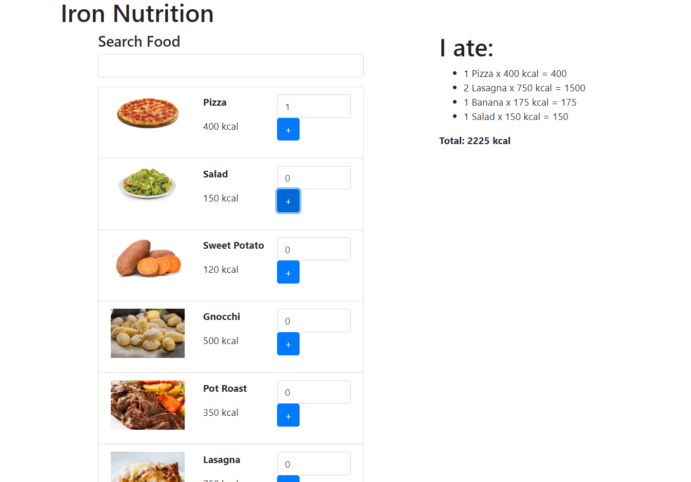

<h1>Nutrition App</h1>

<b>React</b> easy virtual DOM practice. You add items you´ve eated and it adds up the calories on the right side of the screen.  
<h3>Steps to run the app</h3>

In the project directory, you can run: 

### `npm start`

Runs the app in the development mode. 
Open [http://localhost:3000](http://localhost:3000) to view it in the browser.

<h3>Screenshot</h3>

